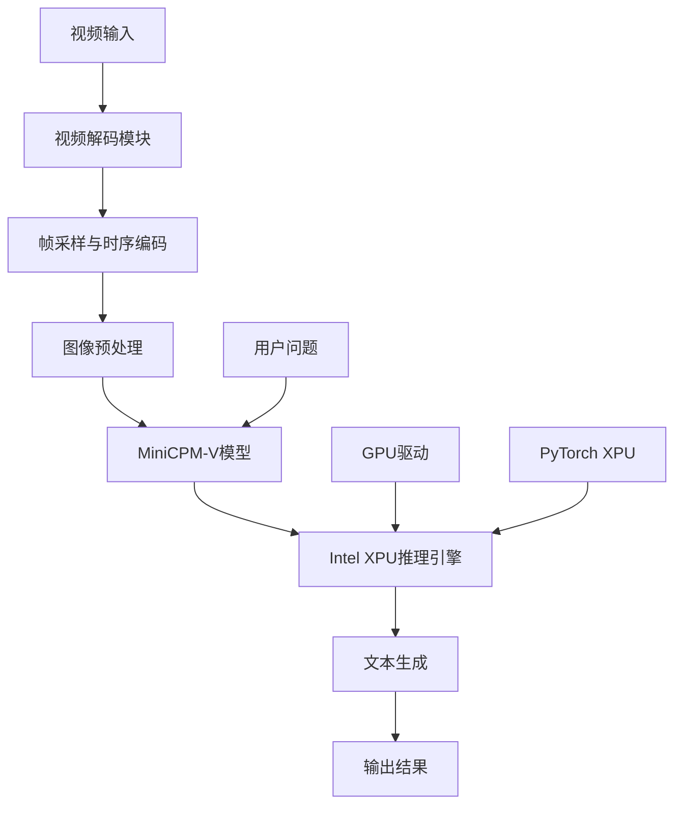
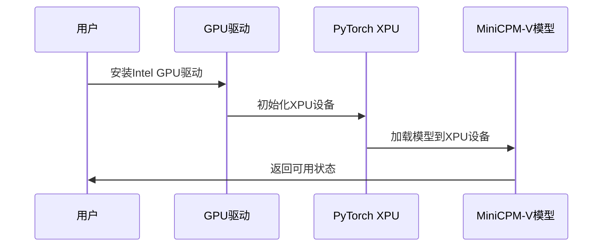
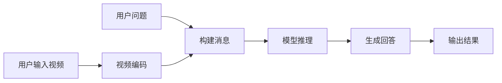
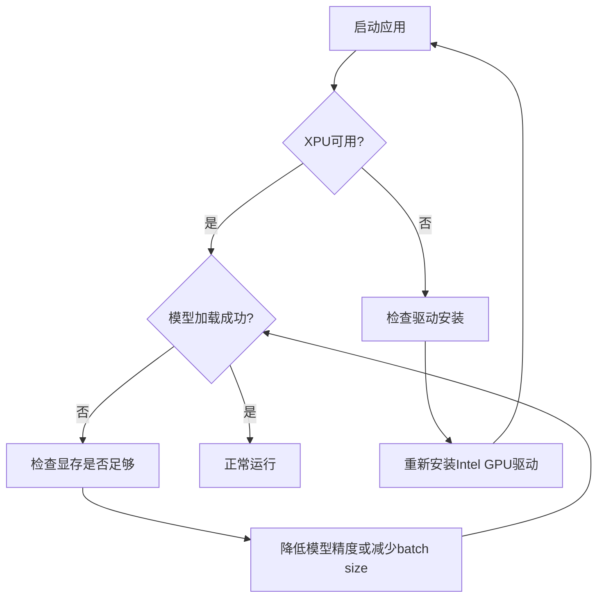

# MiniCPM-V 视频聊天Demo在Intel GPU上的部署设计

## 概述

本设计文档描述了如何在本地Intel Arc iGPU (Intel Arc(tm) 130v GPU 16gb) 上部署MiniCPM-V-4.5模型的视频聊天demo，使用Intel XPU作为推理引擎来实现高效的视频理解和对话功能。

### 目标
- 在Intel Arc 130v GPU上成功运行MiniCPM-V-4.5视频聊天demo
- 充分利用Intel iGPU的16GB显存进行模型推理
- 实现视频帧采样、编码和多模态对话功能
- 确保模型推理性能优化

## 技术栈

| 组件 | 技术选择 | 版本要求 |
|------|----------|----------|
| 深度学习框架 | PyTorch XPU | >= 2.5.0 |
| 模型库 | Transformers | latest |
| 视频处理 | decord | latest |
| 图像处理 | PIL, OpenCV | - |
| 数值计算 | NumPy, SciPy | - |
| Intel GPU加速 | Intel Extension for PyTorch | latest |

## 系统架构



## 核心模块设计

### 1. 环境配置模块

#### Intel GPU驱动配置


#### 依赖安装配置
| 步骤 | 命令 | 说明 |
|------|------|------|
| 1 | 安装Intel GPU驱动 | 从Intel官网下载最新驱动 |
| 2 | `pip install torch torchvision torchaudio --index-url https://download.pytorch.org/whl/xpu` | 安装XPU版本PyTorch |
| 3 | `pip install transformers decord scipy Pillow` | 安装模型依赖 |
| 4 | `python -c "import torch; print(torch.xpu.is_available())"` | 验证XPU可用性 |

### 2. 视频处理模块

#### 视频编码器设计
```python
class VideoEncoder:
    """视频帧采样和时序编码器"""
    
    def __init__(self, max_frames=180, max_packing=3, time_scale=0.1):
        self.MAX_NUM_FRAMES = max_frames
        self.MAX_NUM_PACKING = max_packing  
        self.TIME_SCALE = time_scale
    
    def encode_video(self, video_path, choose_fps=3, force_packing=None):
        """将视频编码为帧序列和时序ID"""
        # 视频解码和采样逻辑
        # 返回: frames (List[PIL.Image]), temporal_ids (List[List[int]])
```

#### 帧采样策略
- **均匀采样**: 根据视频时长和目标FPS进行均匀帧采样
- **时序分组**: 将帧按时间戳分组，支持3D重采样压缩
- **自适应打包**: 根据视频长度动态调整打包策略

### 3. 模型推理模块

#### 模型加载与优化
```python
class MiniCPMVInference:
    """MiniCPM-V模型推理引擎"""
    
    def __init__(self, model_path='openbmb/MiniCPM-V-4_5'):
        # 模型加载到Intel XPU设备
        self.model = self._load_model_to_xpu(model_path)
        self.tokenizer = self._load_tokenizer(model_path)
    
    def _load_model_to_xpu(self, model_path):
        """加载模型到Intel XPU设备"""
        model = AutoModel.from_pretrained(
            model_path,
            trust_remote_code=True,
            attn_implementation='sdpa',
            torch_dtype=torch.bfloat16
        )
        return model.eval().to('xpu')  # 使用XPU设备
```

#### 推理优化策略
| 优化方式 | 配置 | 效果 |
|----------|------|------|
| 数据类型 | torch.bfloat16 | 减少显存占用，提升速度 |
| 注意力实现 | sdpa | 优化注意力计算效率 |
| 设备放置 | 'xpu' | 充分利用Intel GPU |
| 编译优化 | torch.compile | 进一步加速推理 |

### 4. 对话交互模块

#### 消息处理流程


#### 对话接口设计
```python
class VideoChatInterface:
    """视频聊天交互接口"""
    
    def chat_with_video(self, video_path, question, fps=5):
        """视频对话主接口"""
        # 1. 视频编码
        frames, temporal_ids = self.video_encoder.encode_video(video_path, fps)
        
        # 2. 构建消息
        msgs = [{'role': 'user', 'content': frames + [question]}]
        
        # 3. 模型推理
        answer = self.model.chat(
            msgs=msgs,
            tokenizer=self.tokenizer,
            use_image_id=False,
            max_slice_nums=1,
            temporal_ids=temporal_ids
        )
        
        return answer
```

## 部署配置

### 硬件要求验证
- **GPU型号**: Intel Arc(tm) 130v GPU 16GB ✓
- **显存需求**: MiniCPM-V-4.5约需8-12GB显存
- **系统支持**: Windows 11 / Ubuntu 24.04

### 环境变量配置
```bash
# Intel GPU相关环境变量
export SYCL_CACHE_PERSISTENT=1
export ZE_AFFINITY_MASK=0
export USE_XPU=1
```

### 性能调优参数
| 参数 | 推荐值 | 说明 |
|------|--------|------|
| MAX_NUM_FRAMES | 180 | 最大帧数限制 |
| MAX_NUM_PACKING | 3 | 时序打包数量 |
| choose_fps | 3-5 | 采样帧率 |
| torch_dtype | bfloat16 | 推理精度 |

## 错误处理与监控

### 常见问题处理


### 监控指标
- **GPU利用率**: 通过`intel_gpu_top`监控
- **显存使用**: `torch.xpu.memory_usage()`
- **推理延迟**: 端到端响应时间
- **帧处理速度**: FPS处理性能

## 测试策略

### 功能测试用例
| 测试场景 | 输入 | 预期输出 |
|----------|------|----------|
| 短视频对话 | 10秒视频 + "描述这个视频" | 准确的视频内容描述 |
| 长视频分析 | 2分钟视频 + 具体问题 | 基于视频内容的回答 |
| 多轮对话 | 同一视频多次提问 | 上下文相关的回答 |

### 性能测试基准
- **加载时间**: 模型初始化 < 30秒
- **推理速度**: 单次对话 < 10秒  
- **显存使用**: < 14GB (留有余量)
- **GPU利用率**: > 80%

### 集成测试流程


## 安全考虑

### 模型安全
- 使用官方验证的模型权重
- 启用`trust_remote_code=True`时注意代码审查
- 定期更新模型和依赖库

### 数据隐私
- 本地推理，视频数据不上传云端
- 支持临时文件自动清理
- 用户数据加密存储选项

### 系统安全
- GPU驱动程序保持最新版本
- 限制模型访问的系统资源
- 异常情况下的优雅降级机制